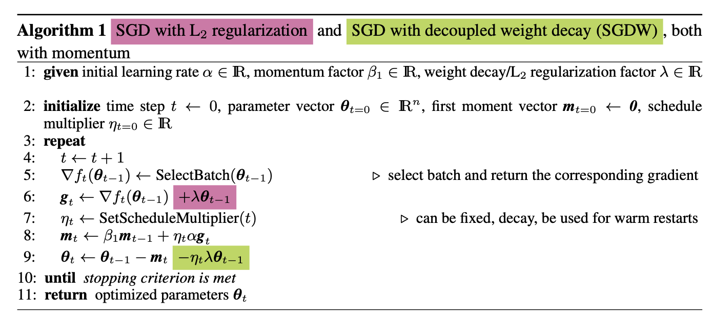
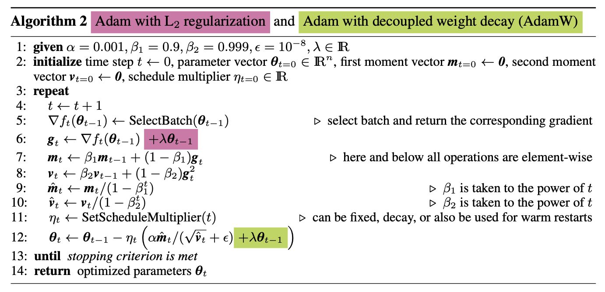
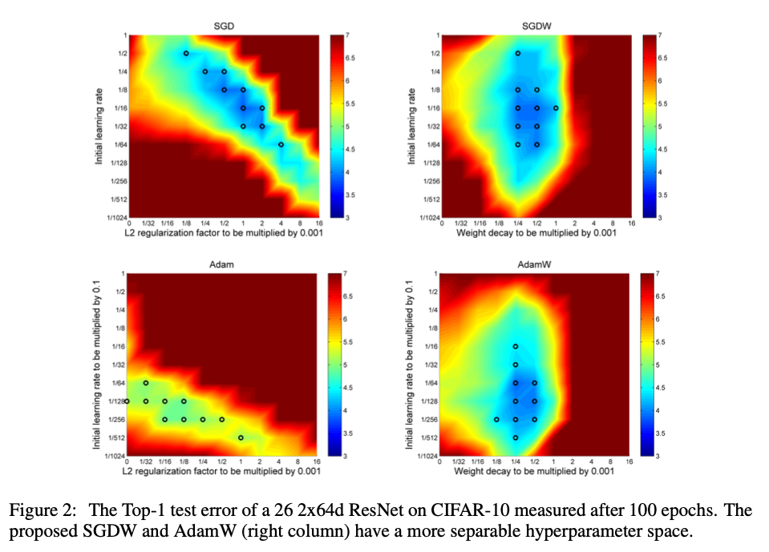
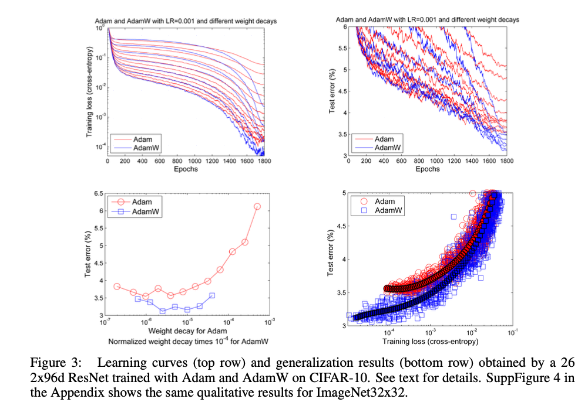
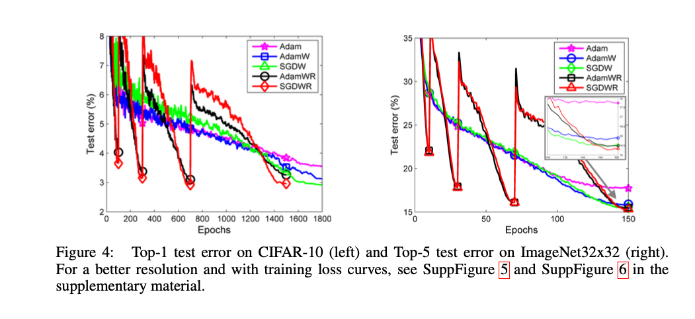

# Homework 3: DECOUPLED WEIGHT DECAY REGULARIZATION
Ad Soyad: Önder Görmez  
Öğrenci No: 21501035  
[Youtube - Önder Görmez - Makale Özet Anlatım](https://youtu.be/GRe3MtoDk-Y)

# Soru 1
Makaleye göre kullanılan mevcut yöntemler nelerdir ve ne gibi problemler bulunmaktadır? Maddeler halinde açıklayınız.

# Cevap 1

Makalede;
* Genel olarak Adam ve SGD yöntemleri üzerinde yaptıkları deneysel çalışmalardan bahsedilmektedir.
* L2 regularization ve weight decay yöntemlerinin literatürde birbirinin yerine (ki bunun bazı durumlarda yanlış olduğunu söylüyor) kullanıldığından bahsetmektedir.
* SGD yöntemi için L2 regularization ve weight decay yöntemlerinin aynı sonucu verdiğinden bahsetmektedir.
* Fakat yapılan çalışmalarda Adam gibi adaptive gradient yöntemlerinde bu durumun geçerli olmadığını belirtmektedir.

Kullanılan mevcut yöntemler aşağıdaki gibidir:

## Adam (Adaptive Moment Estimation)

Adam, loss fonksiyonunu minimize etmek için kullanılan iteratif bir optimizasyon algoritmasıdır.  
Adam yöntemini kısaca tanımlamak gerekirse, RMSprop ve Stochastic Gradient Descent with Momentum (SGD with Momentum) algoritmalarının bir kombinasyonudur diyebiliriz. [[1]](#[1])

Makalede;  
* Adam yönteminde, mevcut implementasyonlar L2 regularization ile yapıldığı için, SGD yönteminden çok daha kötü performansa neden olduğu söylenmektedir.

## SGD (Stochastic Gradient Descent)
Objective fonksiyonunun optimize edilmesi için kullanılan iteratif bir optimizasyon algoritmasıdır.  Kısaca tüm dataset üzerinden gradient hesaplanmaz, veri setinden rastgele seçilen bir örneklem üzerinden hesaplamalar yapılır. Böylelikle büyük verilerde daha hızlı sonuç alınabilir. [[2]](#[2])

Makalede;  
L2 regularization yönteminin ve weigth decay yönteminin SGD yönteminde aynı sonucu verdiği belirtilmektedir.

# Soru 2
Makalede önerilen yöntemleri algoritmaları üzerinden adım adım açıklayınız. Açıklama sırasında derste gördüğümüz derin öğrenme optimizasyon yaklaşımlarıyla kıyaslayınız.

# Cevap 2

L2 regularization ve weight decay ın, çok yaygın olarak kullanılan deep learning kütüphanelerinde bile, isimlendirme olarak birbirinin yerine kullanıldığını söylemişler. Fakat bu durum SGD gibi yöntemlerde doğru olsa da apdaptive gradient (ADAM gibi) yöntemlerinde doğru değildir. Makalede bunun neden doğru olmadığını açıklamışlar.

* SGD with L2 regularization ile kendi önerdikleri SGD with decoupled weight decay (SGDW) yi karşılaştırmışlardır.
* SGD yöntemi için ortaya çıkan iki denkleminde ağırlıkları **aynı oranda sıfıra yaklaştırdığını** denklem üzerinden görebiliyoruz.

Image Source: [[3]](#[3])

* Adam with L2 regularization ile kendi önerdikleri Adam with decoupled weight decay (AdamW) yi karşılaştırmışlardır.
* Adam yöntemi için ortaya çıkan iki denkleminde ağırlıkları **aynı oranda sıfıra yaklaştırmadığını** denklem üzerinden görebiliyoruz.
* Bununda Adam ın performansını arttırdığını ve olumlu bir etki oluşturduğunu belirtmişlerdir.
 

Image Source: [[3]](#[3])

# Soru 3
Makalenin literatüre katkıları nelerdir? Eklenen hangi eşitlikler yöntemin farklılaşmasını sağlamaktadır? Bunun sayesinde hangi problemleri çözebilmektedir?

# Cevap 3

* Makale içerisinde literatüre ana katkılarının, **adam yönteminde weight decay ile gradient based update algoritmasını birbirinden ayırarak daha iyi bir regularizasyon** elde etmeleri olduğu söylenmiştir.
* Yukarıdaki katkıları ile farklı data setleri üzerinde de sonuçlarını doğruladıklarını ve **test error unda %15 civarında bir iyileştirme** elde ettiklerini söylemişler.
* Ek olarak bu iyileştirmeyle Adam yerine SGD with momentum yöntemi kullanmayı gerektiren durumları ortadan kaldırmışlardır. Böylelikle **uygulama pratiğinde dataset / task-specific optimizer seçimi yapma gerekliliğini ortadan kaldırmışlardır**.

# Soru 4
Deneysel sonuçları tüm analizleri kapsayacak şekilde yorumlayınız.

# Cevap 4

Alpha: Leraning Rate  
Lambda: Regularization Parameter

Aşağıda verilen figürü yorumlamak gerekirse;
* **En iyi 10 hiperparametre** değerleri **siyah çemberler** ile gösterilmiştir.
* **L2 regularization** kullanılan yöntemlere bakarsak bu **hiperparametreler diagonal bir çizgi** oluşturmaktadır. Bu durumda hiperparametrenin hem initial learning rate e hem de regularization parametresine bağlı olduğunu söyleyebiliriz.
  * Bu durumda iki değişkenin birlikte değiştirilerek optimizasyon yapılması gerekir. Bu da zor bir işlemdir.
* **Weight decay** kullanılan yöntemlere bakarsak **learning rate ve hiperparametreler birbirinden neredeyse bağımsızdır**. 
  * Böylelikle ayrı ayrı optimize edilebilirler.
* Sonuç olarak Figure 2 learning rate ve hyperparameter lerin birbirinden ayrılabileceği **hipotezinin doğru olduğunu göstermektedir**.

Image Source: [[3]](#[3])

* **Learning rate i 0.001** olarak **sabit** tutarak, L2 regularization ve weight decay yöntemleri karşılaştırılmıştır.
* Sol altta L2 regularization ın weight decay a göre çok daha kötü bir performans gösterdiğini görüyoruz.
* Sol üstte **training loss un epoch arttıkça azalışını** görüyoruz. 1600 epoch dan sonra ciddi oranda azalış göstermektedir. AdamW yönteminde bu azalış daha belirgin olmaktadır.
* Sağ üstte **test error un epoch arttıkça azalışını** görüyoruz. 1600 epoch dan sonra ciddi oranda azalış göstermektedir. AdamW yönteminde bu azalış daha belirgin olmaktadır.
* Sağ altta ise **trainin loss ile test error arasındaki ilişkiyi** görüyoruz. AdamW da test error un daha düşük bir noktaya oturduğu görünüyor.

Image Source: [[3]](#[3])

Warm Restart: Periyodik olarak optimizasyon sürecini **yeniden başlatmak** anlamına gelmektedir. Algoritma **initial condition değerleri güncellenerek** başlatılmış olur.
* Amaç local minimum da sıkışmış olabilecek algoritmanın daha doğru bir sonuca yakınsayabilmesini sağlamaktır.
* Buna ek olarak yavaş yakınsama durumlarında da daha hızlı bir şekilde yakınsama sağlamaktır. [[4]](#[4])

* Burada AdamW test error unda %15 civarında bir iyileştirme elde etmiştir.

Image Source: [[3]](#[3])

# Soru 5
https://github.com/loshchil/AdamW-and-SGDW adresinde bulunan kod makalenin orijinal kaynak
kodunu göstermektedir. Burada, Adam ve versiyonları arasında farklılıkları kod üzerinde (çalıştırmadan) göstererek açıklayınız. (Bu madde istenirse sadece video kaydında anlatılabilir)

# Cevap 5

* https://github.com/facebook/fb.resnet.torch adresinde bulunan kodlar üzerinde değişiklikler yapılarak repo oluşturulmuş.
* Lua denen bir dil kullanılarak yazılmış.
* Algoritmalar adam.lua ve sgd.lua dosyalarında bulunmaktadır.
* Dataset handling
  * dataset-gen.lua is responsible for one-time setup
  * while the dataset.lua handles the actual data loading.

# Faydalı Kaynaklar ve Referanslar
- [1] <a name="[1]"> [Analytics Vidhya - What is Adam Optimizer?](https://www.analyticsvidhya.com/blog/2023/09/what-is-adam-optimizer/#:~:text=The%20Adam%20optimizer%2C%20short%20for,Stochastic%20Gradient%20Descent%20with%20momentum.)
- [2] <a name="[2]"> [Wikipedia - Stochastic gradient descent](https://en.wikipedia.org/wiki/Stochastic_gradient_descent)
- [3] <a name="[3]"> [DECOUPLED WEIGHT DECAY REGULARIZATION - Ilya Loshchilov & Frank Hutter](https://arxiv.org/pdf/1711.05101)
- [4] <a name="[4]"> [activeloop.ai - Warm Restarts](https://www.activeloop.ai/resources/glossary/warm-restarts/#:~:text=Warm%20restarts%20in%20deep%20learning,process%20with%20updated%20initial%20conditions.)
- [5] <a name="[5]"> [Youtube - Önder Görmez - Makale Özet Anlatım](https://youtu.be/GRe3MtoDk-Y)
